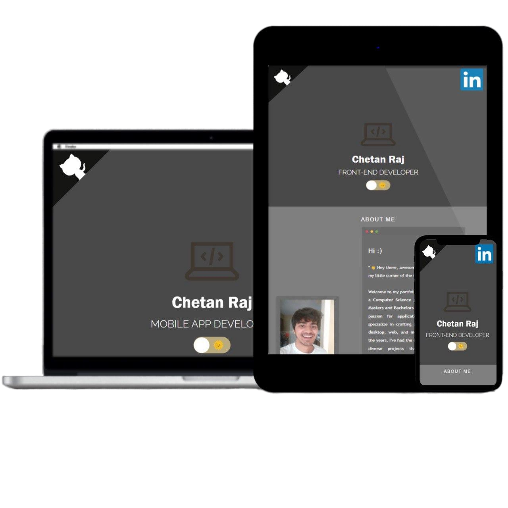

 <br/>


<h2>My Portfolio Using React </h2>

<pre>
⭐ Easy to adapt and deploy portfolio project covering most important 
sections(about, exp, skills, projects), inspired with solutions found 
at GitHub. Check live preview(link below).
</pre>

<strong>:crown: Features⭐</strong>

 &nbsp;  &nbsp;  &nbsp;  &nbsp;  &nbsp;  &nbsp; 
<br/>

<h3>:eye_speech_bubble: Live demo </h3>

Check live demonstration <a  href="https://chetanraj0428-1998.github.io/Portfolio_FullStack/"  target="_blank"><strong>👉👉here👈👈</strong></a>


<h3>:books: Getting started</h3>

1. Clone or fork project.
2. Install required dependencies with `npm install`.
3. Remove `homepage` entirely from `package.json` or set it to single dot. 

```
// package.json
{
  "name": "react-dev-portfolio",
  "homepage": "https://chetanraj0428-1998.github.io/Portfolio_FullSttack/",   <-- remove/edit this
  "version": "0.1.0",
  "private": true,
  "dependencies": {
  ...
}
```

4. `npm start` project and customize it.
5. Deploy on github-pages using `npm run deploy` command.

<pre>
⚠️ Note that:
- if you want to have portfolio on different repository than `{username}.github.io`, 
set `homepage` in `package.json` to `https://{username}.github.io/{repository-name}/` 
before deploying portfolio.
- if you want to run it locally with <strong>npm run start</strong>, make sure that you have edited 
homepage property or json data won't load.
</pre>

<h3>:star: Inspirations</h3>

<a href="https://github.com/stephane-monnot/react-vertical-timeline">React Vertical Timeline</a> <br/>
<a href="https://github.com/rcaferati/react-awesome-slider">React Awesome Slider</a> <br/>
<a href="https://github.com/markusenglund/react-switch">React Switch</a> <br/>
<a href="https://github.com/catalinmiron/react-typical">React Typical</a> <br/>
<a href="https://iconify.design/icon-sets/?query=angular">Iconify Design</a> <br/>
<a href="https://www.w3docs.com/snippets/css/how-to-create-polaroid-image-with-css.html#">Polaroid effect</a> <br/>
<a href="https://tholman.com/github-corners/">GitHub Ref Corner</a>
